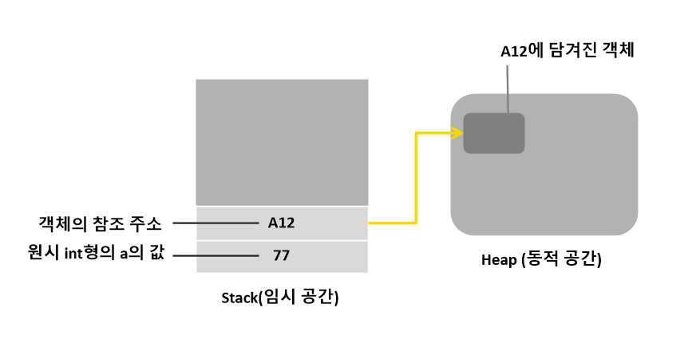
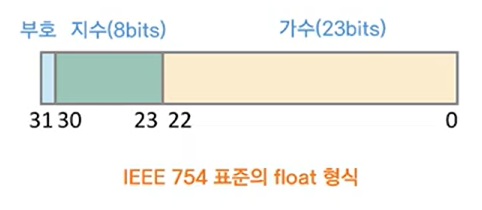
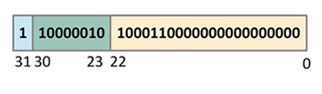
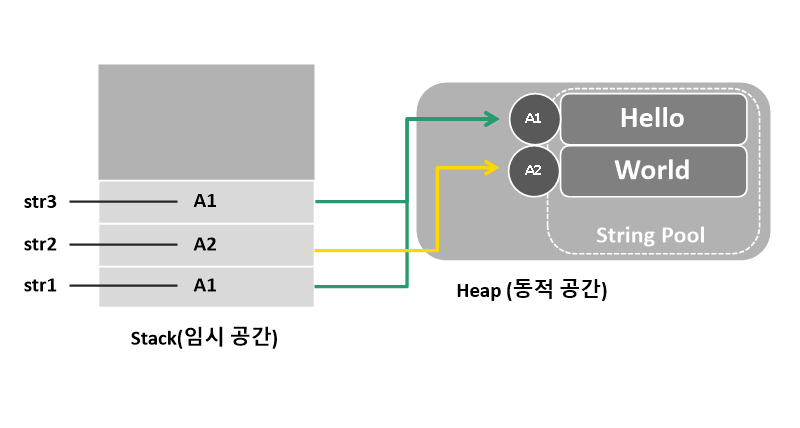

# 자료형
- [기본형과 참조형](#기본형과-참조형)
    - [기본형](#기본형-primitive-type)
    - [참조형](#참조형-reference-type)
    - [기본형과 참조형의 동작 원리 이해하기](#기본형과-참조형의-동작-원리-이해하기)
- [정수형](#정수형)
    - [접미사 접두사 사용](#접미사-접두사-사용)
    - [큰 수 읽기 쉽게 하는 방법](#큰-수-읽기-쉽게-하는-방법)
- [실수형](#실수형)
    - [공간 제약에 따른 부동 소수점 연산의 단점](#공간-제약에-따른-부동-소수점-연산의-단점)
- [정수형과 실수형의 최소 최대 표현](#정수형과-실수형의-최소-최대-표현)
- [논리 자료형](#논리-자료형)
- [문자 자료형](#문자-자료형)
- [문자열 자료형](#문자열-자료형)
___
## 기본형과 참조형
### 기본형 (Primitive Type)
가공되지 않은 순수한 자료형으로 프로그래밍 언어에 내장되어 있다.
> 코틀린에서는 사용되지 않지만 코틀린과 100% 호환되는 자바에서 사용된다.
```java
int, long float, double ...
```
> 성능 면에서는 기본형이 좋다. 하지만 기본형을 막 다루면 복잡해진다.
### 참조형 (Reference Type)
동적 공간에 데이터를 둔 다음 이것을 참조하는 자료형
> 코틀린에서 사용되는 방법이다.
```kotlin
Int, Long, Float, Double ...
```
> 코틀린에서 참조형은 컴파일에서 기본형으로 바뀐다. 이유는 코틀린은 성능을 위해서 코틀린 컴파일러가 알아서 처리한다. 


### 기본형과 참조형의 동작 원리 이해하기
- 자바의 기본형과 참조형의 원리
```java
int a = 77; // 기본형
Person person = new Person(); // 객체 참조형으로 person 객체를 위해 참조 주소(A12)를 갖는다.
```


## 정수형
```kotlin
Byte, Short, Int, Long
```
### 접미사 접두사 사용
```kotlin
val exp01 = 123 // Int형으로 추론
// 접미사
val exp02 = 123L // 접미사 L을 사용해 Long형으로 추론
// 접두사 
val exp03 = 0x0F // 접두사 0x를 사용해 16진수 표기가 사용된 Int형으로 추론
val exp04 = 0b000001011 // 접두사 0b를 사용해 2진수 표기가 사용된 Int형으로 추론
```
### 큰 수 읽기 쉽게 하는 방법
- 읽기 쉽게 하기 위해 언더스코어(_)를 포함해 표현
```kotlin
val number = 1_000_000
```
## 실수형
```kotlin
Float, Double
```
### 공간 제약에 따른 부동 소수점 연산의 단점
> IEEE 754 표준방식으로 진행되면 아래 코드처럼 제한이 생기게 된다. 
```kotlin
var num: Double = 0.1
for (x in 0..999) {
    num += 0.1
}
println(num)
```
```
>>> 100.09999999999859
```

### -12.375 의 표현 (IEEE 754 표준의 float 형식)
IEEE 754 표준의 float 형식 (double 도 똑같다. 범위만 증가할 뿐)
- 음수 : `-`
    - `127 (bias)` 기준으로 구분된다.
- 절댓값 : `12.375`
    - 2진수로 표현 : `1100.011`
    - 맨 앞 숫자만 남기고 소수점 : `1.100011 x 2^3`
    - 1 생략
    - `100011` 을 가수부에 표현
    - 2^3 -> 127(bias) + 3 = 130 = 10000010 (2진수)




## 정수형과 실수형의 최소 최대 표현
```kotlin
println("Byte : ${Byte.MIN_VALUE} ~ ${Byte.MAX_VALUE}")
println("Int : ${Int.MIN_VALUE} ~ ${Int.MAX_VALUE}")
println("Short : ${Short.MIN_VALUE} ~ ${Short.MAX_VALUE}")
println("Long : ${Long.MIN_VALUE} ~ ${Long.MAX_VALUE}")
println("Float : ${Float.MIN_VALUE} ~ ${Float.MAX_VALUE}")
println("Double : ${Double.MIN_VALUE} ~ ${Double.MAX_VALUE}")
```
```
Byte : -128 ~ 127
Int : -2147483648 ~ 2147483647
Short : -32768 ~ 32767
Long : -9223372036854775808 ~ 9223372036854775807
Float : 1.4E-45 ~ 3.4028235E38
Double : 4.9E-324 ~ 1.7976931348623157E308
```
## 논리 자료형
```kotlin
Boolean (1Bit)
val isBoolean: Boolean = true
```
## 문자 자료형
```kotlin
Char (2Byte)
val ch: Char = 'c'
```
## 문자열 자료형
```kotlin
String
```
- String으로 선언되며 String Pool이라는 공간에 구성된다.

```kotlin
// val 이여도 메모리 공간은 바뀌지 않는다.
var str1: String = "Hello" 
var str2 = "World"
var str3 = "Hello"

println("str1 === str2 : ${str1 === str2}")
println("str1 === str3 : ${str1 === str3}")
println("str2 === str3 : ${str2 === str3}")
```
```
str1 === str2 : false
str1 === str3 : true
str2 === str3 : false
```
> == 는 값만 비교, === 는 참조까지 비교한다.    
>(자바는 ==으로 참조를 비교하고 ===연산자는 없다.)

