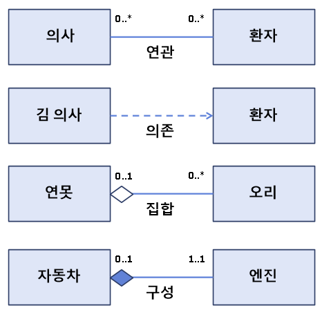

# 클래스와 관계
### 일반적인 실세계의 관계
- 서로 관계를 맺고 서로 메세지를 주고받으며, 필요한 경우 서로의 관게를 이용한다. (아버지와 아들처럼)
## 클래스 혹은 객체 간의 관계
### 관계
- 연관
    - 의사와 환자의 관계. 의사 한 명은 다수의 환자를 돌본다. 하지만 의사가 환자가 한 명도 없을 수도 있다. 반대 입장에서 환자도 환자 한 명은 다수의 의사를 볼 수 있지만 의사가 한 명도 없을 수 있다. 
- 의존
    - 특정 환자가 아프다. 이 환자는 꼭 김 의사를 봐야한다. 이는 의존성이 생긴다.
- 집합
    - 연못이 하나 있고, 연못에 오리가 날라와 오리와 연못이 관계된다. 연못이 있는 것과 없는 것이 존재하고, 오리는 다수 있을 수 있고 없을 수 있다. 연못은 오리를 가지므로 집합 관계이다.
- 구성 
    - 집합과 비슷하다. 하지만 집합은 연못이 없더라도 오리는 날아다닐 수 있다. 그렇기 때문에 구성은 개별적이지 않다. 자동차가 움직이려면 엔진이 하나라도 있어야 한다. 엔진이 자동차의 구성품으로 존재할 경우 구성관계라고 한다.




> **다중성**   
`0..1` : 하나도 없거나 하나의 관계   
`1..*` : 최소한 하나의 관계 혹은 다수   
`0..*` : 하나도 없거나 다수의 관계

> **화살표 표기법**   
`-` : 양방향의 관계를 가진다    
`->` : 특정 한 방향의 관계를 가진다   

## 연관 관계
```kotlin
class Patient(val name: String) {
    fun doctorList(d: Doctor) {
        ...
    }
}

class Doctor(val name: String) {
    fun patientList(p: Patient) {
        ...
    }
}

fun main() {
    val doc1 = Doctor("Kim") // 여기서는 Doctor는 Patient와 연관되어있지 않다.
    val patient1 = Patient("Kill") // 마찬가지로 Patient는 Doctor와 연관되어있지 않다.

    doc1.patientList(patient1) // 이제 연관관계가 나타난다.
    patient1.doctorList(doc1) // 이도 마찬가지이다.
}
```
## 의존 관계
```KOTLIN
class Patient(val name: String, var id: Int) {
    fun doctorList(d: Doctor) {
        ...
    }
}

class Doctor(val name: String, val p: Patient) {
    fun patientList() {
        ...
    }
}

fun main() {
    val patient1 = Patient("Kill", 1) 
    val doc1 = Doctor("Kim", patient1) // p라는 프로퍼티를 2번째 인자로 생성함으로써 Doctor는 Patient의 의존관계를 가지게 된다.

    doc1.patientList() 
}
```
## 집합 관계
```kotlin
class Pond(_name: String, _members: MutableList<Duck>) {
    val name: String = _name
    val members: MutableList<Duck> - _members
    constructor(_name: String): this(_name, mutableListOf<Duck>())
}

class Duck(val name: String)

fun main() {
    // 두 개체는 서로 생명주기에 영향을 주지 않는다.
    val pond = Pond("myFavorite")
    val duck1 = Duck("Duck1")
    val duck2 = Duck("Duck2")

    // 연못에 오리를 추가함으로써, 연못에 오리가 집합한다.
    pond.members.add(duck1)
    pond.members.add(duck2)
    // 연못에 오리가 존재한다.
    for (duck in pond.members) {
        ...
    }
}
```
## 구성 관계
```kotlin
class Car(val name: String, val power: String) {
    private var engine = Engine(power) // Engine 클래스 객체는 Car에 의존적

    fun startEngine() = engine.start()
    fun stopEngin() = engine.stop()
}

class Engine(power: String) {
    fun start() = ...
    fun stop() = ...
}

fun main() {
    val car = Car("k5", "100hp")
    car.startEngine()
    car.stopEngine()
}
```