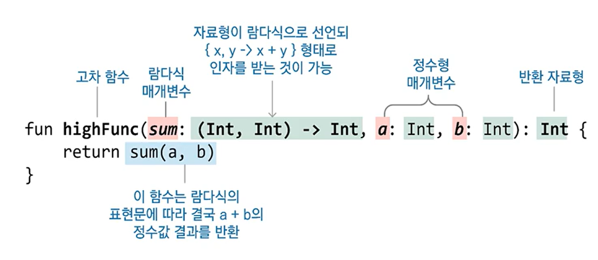

# 함수형 프로그래밍
- [순수 함수](#순수-함수)
- [람다식](#람다식)
- [일급 객체](#일급-객체)

### 코틀린은 다중 패러다임 언어
- 함수형 프로그래밍 (FP: Functional Programming)
- 객체 지향 프로그래밍 (OOP: Object-Oriented Programming)

### 함수형 프로그래밍
- 코드 간략, 테스트나 재사용성 증가
- 람다식, 고차 함수를 사용해 구성
- 순수 함수

### 함수형 프로그래밍 왜 사용하나?
- 프로그램을 모듈화 해 디버깅하거나 테스트가 쉬움
- 간략한 표현식을 사용해 생산성이 높음
- 람다식과 고차함수를 사용하면서 다양한 함수 조합을 사용할 수 있음

## 순수 함수
- 부작용(side-effect)이 없는 함수
    - 동일한 입력 인자에 대해서는 항상 같은 결과를 출력 혹은 반환 한다.
    - 값이 예측이 가능해 결정적이다.   


**순수 함수의 예**   
동일한 인자인 a,b를 입력 받아 항상 a+b를 출력한다.(부작용이 없다.)
```kotlin
fun sum(a: Int, b: Int): Int {
    return a + b
}
```
**순수 함수가 아닌 예**   
check() 함수에 없는 외부의 User 객체를 사용한다. 변수 test는 User.grade() 의 실행 결과에 따라 달라진다.
```kotlin
fun check() {
    val test = User.grade()
    if (test != null) process(test)
}
```
global 변수의 값을 바꾼다면, a와 b의 값이 같더라도 결과 값은 다르게 나온다.
```kotlin
const val global = 10

fun sum(a: Int, b: Int): Int {
    return a + b + global
}
```
### 순수 함수의 조건
- 같은 인자에 대하여 항상 같은 값을 반환
- 함수 외부의 어떤 상태도 바꾸지 않는다.
### 순수 함수를 사용하는 이유?
- 입력과 내용을 분리하고 모듈화 하므로 재사용성이 높아진다.
    - 여러가지 함수들과 조합해도 부작용이 없다.
- 특정 상태에 영향을 주지 않으므로 병행 작업 시 안전하다.
- 함수의 값을 추적하고 예측 할 수 있기때문에 테스트, 디버깅 등이 유리하다.
### 함수형 프로그래밍에 적용
- 함수를 매개변수나 인자, 반환값에 사용 (고차함수)
```kotiln
fun func(testFunc: (Int) -> Int) {}
```
- 함수를 변수나 데이터 구조에 저장
```kotlin
val abc = func()
```
- 유연성 증가

## 람다식
```kotlin
{ x, y -> x + y }
```
- 익명 함수의 하나의 형태로 이름 없이 사용 및 실행이 가능
- 람다 대수로 부터 유래

### 람다식의 이용
- 람다식은 고차 함수에서 인자로 넘기거나 결과값으로 반환 등을 할 수 있다.

## 일급 객체
- 일급 객체는 함수의 인자로 전달할 수 있다.
- 일급 객체는 함수의 반환값에 사용할 수 있다.
- 일급 객체는 변수에 담을 수 있다.

### 코틀린에서는 함수는 1급 객체로 다룬다. (1급 함수라고도 한다.)

## 고차 함수
```kotlin
fun main() {
    println(highFunc({ x, y -> x + y }, 10, 20))
}

fun highFunc(sum: (Int, Int) -> Int, a: Int, b: Int): Int = sum(a,b)
```


람다식을 첫 번째 인자말고 마지막 인자로 사용할 경우 후행람다식으로 간략하게 표현할 수 있다.
```kotlin
fun main() {
    highFunc(1, 2) { x, y ->
        x + y
    }
}

fun highFunc(a: Int, b: Int, sum: (Int, Int) -> Int): Int = sum(a,b)
```